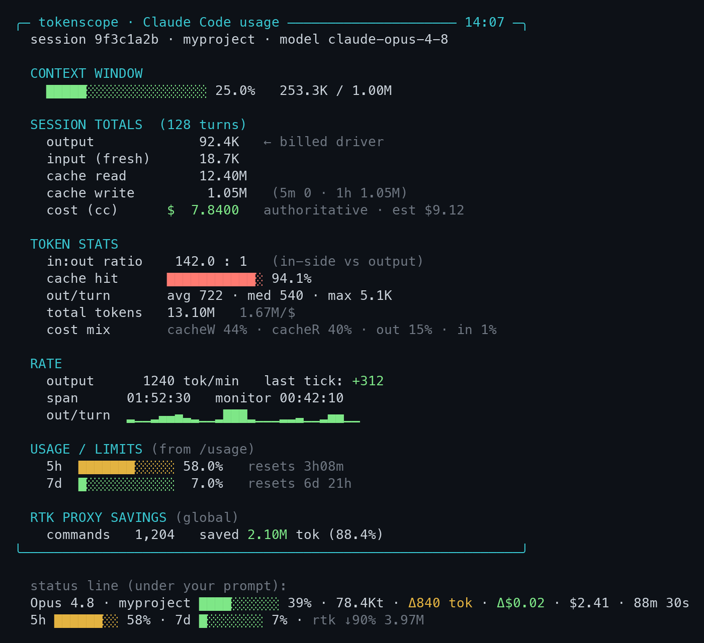
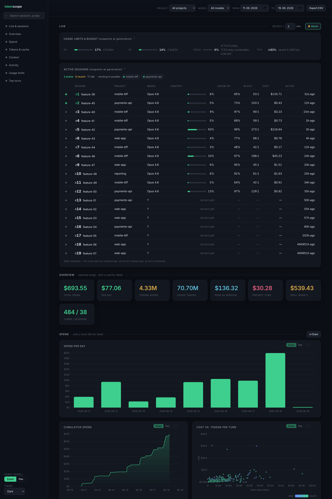

# tokenscope

**A local-first token, cost & rate-limit observatory for [Claude Code](https://code.claude.com) power users.**
A compact visualized **status line** plus a unified `tokenscope` CLI — token usage, cost,
context-window fill, and your subscription rate limits, all from data Claude Code already
emits. No API keys, no telemetry, no network backend.



## Is this for you?

**✅ Built for you if you —**
- run **multiple Claude Code sessions at once** and lose track of them (`grid` is the only local tool for this)
- keep hitting **rate limits or your budget mid-task** with no warning (live 5h/7d burn bars)
- **won't ship your usage to a hosted analytics service** — everything here stays on your machine

**⛔ Not for you if you —**
- are on the **API / Console** (no subscription `rate_limits` field → the limit bars stay empty)
- want your **exact invoice** — all costs here are Claude Code's *client-side estimates*, not authoritative billing

Rate-limit data appears only on **Pro / Max / Team** plans.

## 60-second quickstart

Requires `jq` and `python3` (3.8+, standard library only).

```bash
# 1. install the status line (symlink so repo updates flow through)
ln -sf "$PWD/scripts/statusline.sh" ~/.claude/statusline.sh

# 2. wire it in ~/.claude/settings.json (see settings.example.json):
#    "statusLine": { "type": "command", "command": "~/.claude/statusline.sh" }
#    notifications (optional): ln -sf "$PWD/scripts/notify.sh" ~/.claude/tokenscope-notify.sh

# 3. watch your current session in a second pane
python3 tokenscope.py live
```

Optionally alias it so the commands below are copy-pasteable:

```bash
alias tokenscope='python3 /path/to/tokenscope.py'
# (and if you like: tokstats / tokstats-dash → the report / dashboard subcommands)
```

## I want to… → run this

One entrypoint (`tokenscope.py`) over a shared core (`core/tokcore.py`). The repo is
grouped by concern: `core/` (shared core), `views/` (the renderers — `live`, `grid`,
`report`, `dashboard`, `serve`, `provenance`), `scripts/` (the `.sh` hooks), `docs/`.
`tokenscope.py` puts `core/` and `views/` on the import path, so the subcommands run
unchanged.

| I want to… | command | notes |
|------------|---------|-------|
| watch my **current** session live | `tokenscope live` | default — bare `tokenscope` also works; `-c 2` for two columns |
| see **all my open sessions** at once | `tokenscope grid` | joined to Claude Code's session registry |
| find **where this week's spend went** | `tokenscope report --days 7` | historical CLI analysis (was `tokstats`) |
| **share or inspect** charts offline | `tokenscope dashboard` | self-contained static HTML `file://` (was `tokstats-dash`) |
| keep a **live auto-refreshing** dashboard | `tokenscope serve` | localhost server at `http://127.0.0.1:8765`; the page polls `/data` |

Bare `tokenscope` (with the old `-i/-c/-f/--project` flags) still launches `live`, so existing usage keeps working.

> Status: works, but **pre-1.0** — paths and the turn-log schema may still change.

## What you get

**1. Status line** (`statusline.sh`) — two compact lines under your prompt:

```
Opus 4.8 · myproject ████░░░░░░ 39% · 78400t · Δ840 tok · Δ$0.02 · $2.41 · 88m 30s
5h ██░░░░░░ 24% ↻1h51m · 7d ███████░ 88% ↻4d3h · today 6%/14% · rtk ↓90% 3.97M
```

- context-window bar, live tokens, per-turn token/cost deltas, session cost, elapsed
- **5h / 7d rate-limit bars with reset countdowns** — the same data `/usage` shows
- **today** — how much of an even fair-share day (100%/7 ≈ 14%) of the 7d limit
  you've burned since the first turn today; baseline persists in
  `~/.claude/tokenscope-daily.json`, resets each UTC day or new 7d window
- optional `rtk` token-proxy savings (shown only if an `rtk` CLI is on your `PATH`)

**2. Dashboard** (`tokenscope.py`) — a refreshing full-screen view for a second pane:

```
╭─ tokenscope · Claude Code usage ───────────────── 12:41 ─╮
  session ada2ee06 · myproject · model claude-opus-4-8

  CONTEXT WINDOW            SESSION TOTALS  (340 turns)
    ██████░░░░ 28% 276K/1M    output      308.8K  ← billed driver
                              cache read   43.20M
  TOKEN STATS                 cost (cc)   $24.0451  authoritative
    in:out ratio  149.8 : 1
    cache hit     ████ 94%   RATE
    out/turn      avg 908       output  0 tok/min  last tick: idle
    cost mix      cacheW 46%…   out/turn ▂▁▁▂███▁▁▇▇▁▁
  USAGE / LIMITS (from /usage)
    5h ███████ 59% resets 3h8m  RTK PROXY SAVINGS
    7d █░░░░░░  7% resets 7h18m    saved 3.97M tok (89.9%)
╰──────────────────────────────────────────────────────────╯
```

- **TOKEN STATS** report: cache-hit rate, input:output ratio, per-turn distribution
  (avg/median/max), tokens-per-dollar, cost composition
- authoritative session cost (from the status-line snapshot) vs a local estimate
- **USAGE / LIMITS** — 5h/7d rate limits surfaced from the snapshot
- per-turn output **sparkline**, live output rate
- `-c 2` for a two-column layout



The **HTML dashboard** charts every field the turn log records: spend per day / cumulative / by
project / **by model**, cost-vs-tokens, the 5-hour rolling window, **cache tokens per day**
(read vs. write — usually the bulk of traffic), and **rate-limit burn over time** (5h / 7d %).
`serve` binds to localhost only and exposes a `/data` JSON endpoint the page polls every `-i`
seconds; use `dashboard` when you want a shareable static snapshot instead.

## Notifications & theme

The served dashboard (`tokenscope serve`) places each setting next to the section it
affects: **🔔 Alerts** sits on the **Live** section (it's about sessions wanting you),
**⚙ Chart** sits on the **Spend** section (it tunes the charts), and **Theme** stays
in the header (it's global).

- **🔔 Alerts** (on the Live section) — sounds your machine plays when a session
  wants you. A master on/off, a **volume** slider, plus two events each with its own
  sound (hover the ⓘ for what each is):
  - **Session idle** — a session finished responding and handed control back (the
    `Stop` hook).
  - **Needs your input** — Claude is waiting mid-task on a permission prompt or a
    requested answer (the `Notification` hook).

  Changes are written to `~/.claude/tokenscope-alarm.json`; the `Stop`/`Notification`
  hooks call `notify.sh`, which reads that file and plays the chosen
  `/System/Library/Sounds/*.aiff` at the set volume (`afplay -v`; terminal-bell
  fallback off macOS). Subagent completions deliberately do **not** ring. The static
  `dashboard` export shows the controls view-only (a file:// page can't persist).

- **⚙ Chart** (on the Spend section) — inspection options for precise reading rather
  than at-a-glance shape: **data points** (marker per sample), **exact lines** (disable
  smoothing), **vertical gridlines**, and **drag-to-zoom** (drag across any chart to
  zoom an x-range, double-click to reset; via `chartjs-plugin-zoom`). Remembered in
  `localStorage`.

- **Theme** (header) — Dark / Light / Yellowish, remembered in `localStorage`.

- **Refresh** (header, live only) — how often the dashboard re-polls live data
  (2s/5s/10s/30s/1m/Off), remembered in `localStorage`.

**Inspecting a component.** Every chart card has a top-right **⤢ expand** button; the
KPI/Spend titles are also clickable. Selecting one **highlights it** (accent backlight)
and opens a **detail overlay**: for a chart, the *actual graph* is moved in enlarged and
fully interactive (hover, drag-to-zoom), alongside its what-it-is / how-to-read / insight
text; for a KPI, its live value plus the same notes. One selection at a time; Esc / ✕ /
backdrop closes it and returns the chart to its card.

**Active sessions** are pill-coded in three states and sorted accordingly: **active**
(green — working now), **recent** (amber — idle but seen within the last *N* minutes,
adjustable via *recent ≤ __ min* on the Live section), and **idle** (grey). A summary
line counts each and lists, as chips, the projects with live (active/recent) work — so
parallel work is visible at a glance.

Hook wiring (`~/.claude/settings.json`):

```json
"hooks": {
  "Stop":         [{ "hooks": [{ "type": "command", "command": "~/.claude/tokenscope-notify.sh idle" }] }],
  "Notification": [{ "hooks": [{ "type": "command", "command": "~/.claude/tokenscope-notify.sh needs_input" }] }]
}
```

## Caveats

- `cost.total_cost_usd` is Claude Code's **client-side estimate**, not your invoice.
- The tools' own `est` cost uses the rates in `PRICE` at the top of `tokcore.py` —
  defaults are standard Claude Opus rates; edit them for your plan. The cost-mix proportions
  use those same rates.
- `rate_limits` appear only after the first API turn and only on **Pro/Max/Team** plans.
- `rtk` integration is optional and degrades silently when `rtk` isn't on `PATH`.
- Notification sounds use macOS `afplay`; off macOS they fall back to the terminal bell.

## How it works

Claude Code passes a rich JSON payload to the status-line command on stdin (model, cost,
context window, and — on subscription plans — `rate_limits`). The dashboard gets no stdin,
so the status line writes that payload to `~/.claude/usage-snapshot.json` as the **bridge**,
and appends a line per turn to `~/.claude/turn-log.jsonl`.

```
Claude Code ──stdin──▶ statusline.sh ──▶ usage-snapshot.json ──────┐
                              ├──▶ turn-log.jsonl                   ├─▶ live / report / dashboard
                              └──▶ tokscope-sessions/{id}.json ──┐  │
~/.claude/projects/**/*.jsonl ────────────────────────────────  ┘  ┘
~/.claude/sessions/{pid}.json  (Claude Code's own registry) ──────▶ grid (joined by sessionId)
```

The **turn log** (`~/.claude/turn-log.jsonl`) is an append-only ledger — one JSON line per
completed turn (timestamp, session/project/turn, per-turn and cumulative tokens/cost, model,
context %, cache read/create, 5h/7d burn) that you can post-process for trends.

> **Maintainers / contributors:** [RUNBOOK.md](RUNBOOK.md) has the full architecture, the
> turn-log field-by-field schema, data contracts, the grid registry-join details,
> troubleshooting, and how to extend.

## License

MIT — see [LICENSE](LICENSE).
